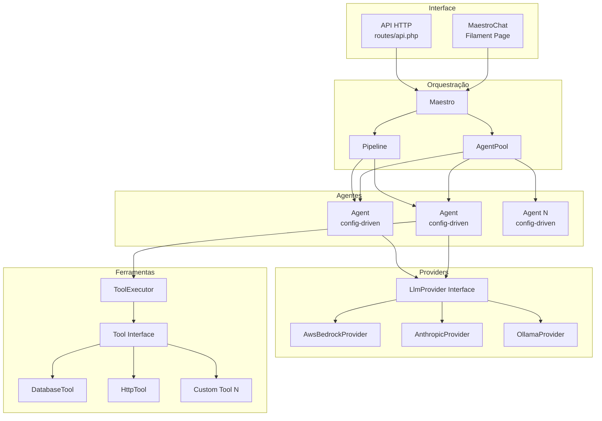
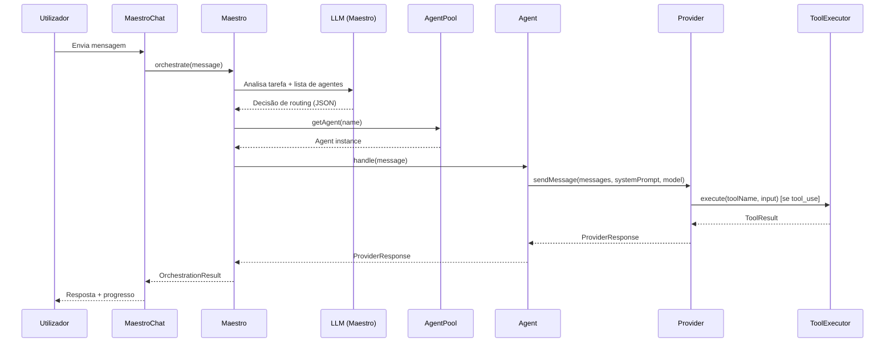

# Documento de Design — Agent Orchestrator

## Visão Geral

O Agent Orchestrator é um sistema multi-agente genérico construído em Laravel 13 que generaliza a arquitetura existente do backoffice RTP Notícias. O sistema é composto por:

- **Camada de Providers**: Abstração sobre múltiplos fornecedores de LLM (AWS Bedrock, Anthropic, Ollama) através de uma interface `LlmProvider`.
- **Camada de Ferramentas**: Sistema extensível de ferramentas (`Tool`) com registo dinâmico via `ToolExecutor`.
- **Camada de Agentes**: Agentes declarativos configurados via ficheiros PHP (`config/agents.php`), cada um com provider, modelo, system prompt e ferramentas.
- **Camada de Orquestração**: O **Maestro** — um agente especial que utiliza um LLM para analisar tarefas e decidir dinamicamente quais agentes invocar, suportando execução individual ou em pipeline sequencial.

A comunicação com o utilizador é feita através da página Filament `MaestroChat` (já existente) e de uma API HTTP para integrações externas.

### Decisões de Design

1. **Config-driven agents**: Os agentes são 100% declarativos — definidos em `config/agents.php` sem necessidade de classes PHP por agente. Isto permite adicionar/remover agentes editando apenas configuração.
2. **Interface `Tool` em vez de hardcoded match**: Ao contrário do backoffice (que usa `match($toolName)` no ToolExecutor), o novo sistema usa uma interface `Tool` com registo dinâmico, permitindo extensibilidade sem modificar o executor.
3. **Maestro como LLM-router**: O routing de tarefas é decidido pelo LLM do Maestro (não por regras codificadas), tornando o sistema adaptável a novos agentes sem alteração de código.
4. **Pipeline como componente separado**: A execução sequencial de agentes é encapsulada numa classe `Pipeline` reutilizável, desacoplada do Maestro.

## Arquitetura

### Diagrama de Componentes



### Diagrama de Sequência — Fluxo Principal



### Estrutura de Diretórios

```
app/Support/Maestro/
├── Contracts/
│   ├── LlmProvider.php          # Interface para providers LLM
│   └── Tool.php                 # Interface para ferramentas
├── DTOs/
│   ├── ProviderResponse.php     # Resposta de um provider LLM
│   ├── ToolResult.php           # Resultado de execução de ferramenta
│   ├── AgentConfig.php          # Configuração declarativa de um agente
│   └── OrchestrationResult.php  # Resultado final da orquestração
├── Providers/
│   ├── AwsBedrockProvider.php   # Provider AWS Bedrock Converse API
│   ├── AnthropicProvider.php    # Provider Anthropic Messages API
│   └── OllamaProvider.php       # Provider Ollama (local/remoto)
├── Tools/
│   ├── ToolExecutor.php         # Registo e despacho de ferramentas
│   └── DatabaseTool.php         # Ferramenta de consulta SQL (exemplo)
├── Agent.php                    # Agente individual (config-driven)
├── AgentPool.php                # Registo de agentes carregado de config
├── Pipeline.php                 # Execução sequencial de agentes
└── Maestro.php                  # Orquestrador principal (LLM-router)

config/
└── agents.php                   # Configuração declarativa de todos os agentes

routes/
└── api.php                      # Endpoints HTTP para orquestração
```

## Componentes e Interfaces

### 1. LlmProvider (Interface)

```php
namespace App\Support\Maestro\Contracts;

use App\Support\Maestro\DTOs\ProviderResponse;

interface LlmProvider
{
    public function sendMessage(
        array $messages,
        string $systemPrompt,
        string $model,
        array $config = []
    ): ProviderResponse;

    public function getName(): string;

    public function supportsTools(): bool;

    public function setProgressCallback(callable $callback): void;
}
```

Generaliza a interface do backoffice, adicionando `setProgressCallback` como método obrigatório do contrato (no backoffice era opcional via `method_exists`).

### 2. Tool (Interface)

```php
namespace App\Support\Maestro\Contracts;

use App\Support\Maestro\DTOs\ToolResult;

interface Tool
{
    public function name(): string;

    public function description(): string;

    public function inputSchema(): array;

    public function execute(array $input): ToolResult;
}
```

Nova interface que substitui o `match` hardcoded do backoffice. Cada ferramenta é auto-descritiva (nome, descrição, schema) para registo automático no ToolExecutor.

### 3. ToolExecutor

```php
namespace App\Support\Maestro\Tools;

use App\Support\Maestro\Contracts\Tool;
use App\Support\Maestro\DTOs\ToolResult;

class ToolExecutor
{
    /** @var array<string, Tool> */
    private array $tools = [];

    public function register(Tool $tool): void;
    public function execute(string $toolName, array $input): ToolResult;
    public function getAvailableTools(): array;       // Formato Anthropic
    public function getAwsBedrockTools(): array;      // Formato AWS Bedrock
    public function has(string $toolName): bool;
}
```

Ao contrário do backoffice (que instancia ferramentas no construtor), o novo ToolExecutor aceita registo dinâmico via `register()`. As ferramentas disponíveis para cada agente são filtradas com base na configuração do agente.

### 4. Agent

```php
namespace App\Support\Maestro;

use App\Support\Maestro\Contracts\LlmProvider;
use App\Support\Maestro\DTOs\AgentConfig;
use App\Support\Maestro\DTOs\ProviderResponse;
use App\Support\Maestro\Tools\ToolExecutor;

class Agent
{
    public function __construct(
        private readonly AgentConfig $config,
        private readonly LlmProvider $provider,
        private readonly ToolExecutor $toolExecutor,
    ) {}

    public function handle(string $message, array $history = [], ?callable $progressCallback = null): ProviderResponse;
    public function getConfig(): AgentConfig;
}
```

Cada Agent é uma instância genérica configurada via `AgentConfig`. Não existem subclasses por agente — toda a especialização vem da configuração.

### 5. AgentPool

```php
namespace App\Support\Maestro;

use App\Support\Maestro\DTOs\AgentConfig;

class AgentPool
{
    /** @var array<string, Agent> */
    private array $agents = [];

    public function __construct(array $agentConfigs, /* provider factory, tool registry */);
    public function get(string $name): Agent;
    public function has(string $name): bool;
    public function all(): array;
    public function getDescriptions(): array; // Para o system prompt do Maestro
}
```

Carregado a partir de `config('agents')`. Lança exceção se um agente referenciado não existir.

### 6. Pipeline

```php
namespace App\Support\Maestro;

use App\Support\Maestro\DTOs\OrchestrationResult;

class Pipeline
{
    /**
     * @param list<string> $agentNames  Nomes dos agentes a executar em sequência
     */
    public function execute(
        array $agentNames,
        string $initialMessage,
        AgentPool $pool,
        ?callable $progressCallback = null
    ): OrchestrationResult;
}
```

Executa agentes em sequência, passando o output de cada um como input do seguinte. Acumula tokens e regista o histórico de cada passo.

### 7. Maestro

```php
namespace App\Support\Maestro;

use App\Support\Maestro\DTOs\OrchestrationResult;

class Maestro
{
    public function __construct(
        private readonly AgentPool $agentPool,
        private readonly Agent $routerAgent,  // O próprio Maestro como agente LLM
    ) {}

    public function orchestrate(
        string $message,
        array $history = [],
        ?callable $progressCallback = null
    ): OrchestrationResult;
}
```

O Maestro utiliza o seu próprio agente LLM (`routerAgent`) para analisar a tarefa e produzir uma decisão de routing em JSON. O system prompt do routerAgent inclui a lista de agentes disponíveis com nomes e descrições.

### 8. API Controller

```php
namespace App\Http\Controllers;

use App\Support\Maestro\Maestro;
use Illuminate\Http\JsonResponse;
use Illuminate\Http\Request;

class OrchestrationController extends Controller
{
    public function orchestrate(Request $request): JsonResponse;
}
```

Endpoint POST que delega ao Maestro e retorna `OrchestrationResult` em JSON.

## Modelos de Dados (DTOs)

### ProviderResponse

```php
namespace App\Support\Maestro\DTOs;

class ProviderResponse
{
    public function __construct(
        public readonly string $text,
        public readonly int $inputTokens = 0,
        public readonly int $outputTokens = 0,
        public readonly array $metadata = [],
    ) {}

    public static function create(string $text, int $inputTokens = 0, int $outputTokens = 0, array $metadata = []): self;
    public function getTotalTokens(): int;
    public function toArray(): array;
}
```

### ToolResult

```php
namespace App\Support\Maestro\DTOs;

class ToolResult
{
    public function __construct(
        public readonly bool $success,
        public readonly mixed $data = null,
        public readonly ?string $error = null,
        public readonly array $metadata = [],
    ) {}

    public static function success(mixed $data, array $metadata = []): self;
    public static function failure(string $error, array $metadata = []): self;
    public function isSuccess(): bool;
    public function toArray(): array;
}
```

### AgentConfig

```php
namespace App\Support\Maestro\DTOs;

class AgentConfig
{
    public function __construct(
        public readonly string $name,
        public readonly string $description,
        public readonly string $provider,       // 'aws-bedrock', 'anthropic', 'ollama'
        public readonly string $model,
        public readonly string $systemPrompt,
        public readonly float $temperature = 0.7,
        public readonly int $maxTokens = 4096,
        public readonly array $tools = [],      // Lista de nomes de ferramentas
        public readonly array $metadata = [],
    ) {}

    public static function fromArray(array $data): self;
    public function toArray(): array;
}
```

Campos obrigatórios para `fromArray()`: `name`, `description`, `provider`, `model`, `system_prompt`. Se algum estiver em falta, lança `\InvalidArgumentException` com a lista de campos em falta.

### OrchestrationResult

```php
namespace App\Support\Maestro\DTOs;

class OrchestrationResult
{
    public function __construct(
        public readonly string $response,
        public readonly bool $success,
        public readonly int $totalInputTokens = 0,
        public readonly int $totalOutputTokens = 0,
        public readonly array $agentHistory = [],   // [{name, input, output, tokens, duration_ms}]
        public readonly ?string $error = null,
        public readonly array $metadata = [],       // Inclui timing total
    ) {}

    public static function success(string $response, int $inputTokens, int $outputTokens, array $history, array $metadata = []): self;
    public static function failure(string $error, array $partialHistory = [], int $inputTokens = 0, int $outputTokens = 0): self;
    public function toArray(): array;
}
```

### Estrutura de Configuração (`config/agents.php`)

```php
return [
    'maestro' => [
        'provider' => env('MAESTRO_PROVIDER', 'aws-bedrock'),
        'model' => env('MAESTRO_MODEL', 'us.anthropic.claude-3-5-haiku-20241022-v1:0'),
        'temperature' => 0.3,
        'max_tokens' => 1024,
        'system_prompt' => 'Tu és o Maestro, um orquestrador inteligente...',
    ],

    'providers' => [
        'aws-bedrock' => [
            'region' => env('AWS_BEDROCK_REGION', 'us-east-1'),
            'bearer_token' => env('AWS_BEDROCK_BEARER_TOKEN'),
            'max_tool_iterations' => 6,
        ],
        'anthropic' => [
            'api_key' => env('ANTHROPIC_API_KEY'),
            'api_version' => '2023-06-01',
            'max_tool_iterations' => 10,
        ],
        'ollama' => [
            'base_url' => env('OLLAMA_URL', 'http://localhost:11434'),
            'timeout' => 120,
        ],
    ],

    'agents' => [
        'summarizer' => [
            'name' => 'summarizer',
            'description' => 'Sumariza textos longos em resumos concisos.',
            'provider' => 'aws-bedrock',
            'model' => 'us.amazon.nova-lite-v1:0',
            'system_prompt' => 'Tu és um agente especializado em sumarização...',
            'temperature' => 0.3,
            'max_tokens' => 2048,
            'tools' => [],
        ],
        'researcher' => [
            'name' => 'researcher',
            'description' => 'Pesquisa informação em bases de dados e APIs.',
            'provider' => 'anthropic',
            'model' => 'claude-sonnet-4-20250514',
            'system_prompt' => 'Tu és um agente de pesquisa...',
            'temperature' => 0.5,
            'max_tokens' => 4096,
            'tools' => ['database_query'],
        ],
        // ... mais agentes
    ],
];
```

## Propriedades de Correção

_Uma propriedade é uma característica ou comportamento que deve ser verdadeiro em todas as execuções válidas de um sistema — essencialmente, uma declaração formal sobre o que o sistema deve fazer. As propriedades servem como ponte entre especificações legíveis por humanos e garantias de correção verificáveis por máquina._

### Propriedade 1: Despacho correto do ToolExecutor

_Para qualquer_ conjunto de ferramentas registadas no ToolExecutor, e para qualquer nome de ferramenta registado, executar `execute(toolName, input)` deverá invocar exatamente a ferramenta correspondente a esse nome e retornar o seu resultado.

**Valida: Requisitos 3.1**

### Propriedade 2: Round-trip dos factory methods do ToolResult

_Para qualquer_ dados de sucesso (data + metadata) ou dados de falha (error + metadata), criar um ToolResult via `success()` ou `failure()` e depois converter via `toArray()` deverá produzir um array que contém `success: true/false` e os dados/erro correspondentes. Adicionalmente, `isSuccess()` deverá retornar `true` para resultados de sucesso e `false` para resultados de falha.

**Valida: Requisitos 3.2, 3.3, 3.6**

### Propriedade 3: Conversão de formato de ferramentas para providers

_Para qualquer_ conjunto de ferramentas registadas no ToolExecutor, `getAvailableTools()` deverá retornar um array onde cada elemento contém `name`, `description` e `input_schema`; e `getAwsBedrockTools()` deverá retornar um array onde cada elemento contém `toolSpec` com `name`, `description` e `inputSchema.json`.

**Valida: Requisitos 3.4**

### Propriedade 4: Round-trip de serialização do AgentConfig

_Para qualquer_ AgentConfig válido (com nome, descrição, provider, modelo, system prompt, temperatura, max_tokens e ferramentas), serializar via `toArray()` e depois desserializar via `fromArray()` deverá produzir um AgentConfig com todos os campos equivalentes ao original.

**Valida: Requisitos 4.2, 9.1, 9.2, 9.3**

### Propriedade 5: Disponibilidade de agentes no AgentPool

_Para qualquer_ conjunto de configurações de agentes válidas carregadas no AgentPool, cada agente deverá ser recuperável via `get(name)` pelo seu nome, e `all()` deverá retornar exatamente o mesmo número de agentes que as configurações fornecidas.

**Valida: Requisitos 4.3, 4.4**

### Propriedade 6: Propagação de configuração do Agent para o Provider

_Para qualquer_ AgentConfig com um system prompt definido, quando o Agent executa `handle()`, o system prompt passado ao LlmProvider deverá ser exatamente o system prompt da configuração do agente.

**Valida: Requisitos 5.2**

### Propriedade 7: Completude do system prompt do Maestro

_Para qualquer_ conjunto de agentes no AgentPool, o system prompt construído para o routerAgent do Maestro deverá conter o nome e a descrição de cada agente disponível no pool.

**Valida: Requisitos 6.2**

### Propriedade 8: Encadeamento e histórico do Pipeline

_Para qualquer_ sequência de N agentes (com N ≥ 2) executados num Pipeline, o input do agente na posição i+1 deverá ser igual ao output (texto) do agente na posição i, e o `agentHistory` do OrchestrationResult deverá conter exatamente N entradas na ordem correta de execução.

**Valida: Requisitos 7.1, 7.2**

### Propriedade 9: Acumulação de tokens no Pipeline

_Para qualquer_ sequência de agentes executados num Pipeline, o `totalInputTokens` do OrchestrationResult deverá ser igual à soma dos `inputTokens` de cada agente, e o `totalOutputTokens` deverá ser igual à soma dos `outputTokens` de cada agente.

**Valida: Requisitos 6.6, 7.3**

### Propriedade 10: Serialização completa do OrchestrationResult

_Para qualquer_ OrchestrationResult (sucesso ou falha), `toArray()` deverá produzir um array que contém as chaves `response`, `success`, `total_input_tokens`, `total_output_tokens`, `agent_history` e `metadata`; e o array deverá ser serializável para JSON válido via `json_encode()`.

**Valida: Requisitos 8.1, 8.2, 8.3, 8.4**

## Tratamento de Erros

### Erros de Provider (LLM)

| Cenário                                  | Comportamento                                                                         |
| ---------------------------------------- | ------------------------------------------------------------------------------------- |
| Token/API key em falta                   | `\InvalidArgumentException` antes de fazer o pedido HTTP                              |
| Erro HTTP 4xx/5xx                        | `\RuntimeException` com mensagem amigável (sem expor detalhes internos ao utilizador) |
| Timeout de rede                          | `\RuntimeException` com mensagem de timeout                                           |
| Resposta vazia do LLM                    | O Agent retorna mensagem de fallback descritiva em vez de string vazia                |
| Limite de iterações de tool-use atingido | O Provider retorna mensagem informativa pedindo reformulação                          |

### Erros de Ferramentas (Tools)

| Cenário                   | Comportamento                                                                   |
| ------------------------- | ------------------------------------------------------------------------------- |
| Ferramenta não encontrada | `ToolResult::failure("Unknown tool: {name}")`                                   |
| Exceção durante execução  | `ToolResult::failure($exception->getMessage())` — nunca propaga exceção         |
| Input inválido            | A ferramenta individual retorna `ToolResult::failure()` com mensagem descritiva |

### Erros de Configuração

| Cenário                                     | Comportamento                                                   |
| ------------------------------------------- | --------------------------------------------------------------- |
| Campos obrigatórios em falta no AgentConfig | `\InvalidArgumentException` com lista de campos em falta        |
| Agente não encontrado no AgentPool          | `\InvalidArgumentException("Agent '{name}' not found in pool")` |
| Provider desconhecido na configuração       | `\InvalidArgumentException("Unsupported provider: {name}")`     |

### Erros de Pipeline

| Cenário                          | Comportamento                                                                       |
| -------------------------------- | ----------------------------------------------------------------------------------- |
| Agente falha no meio do pipeline | Pipeline interrompe, retorna `OrchestrationResult::failure()` com histórico parcial |
| Pipeline vazio (sem agentes)     | `\InvalidArgumentException("Pipeline requires at least one agent")`                 |

### Erros de API HTTP

| Cenário                        | Código HTTP | Resposta                                                              |
| ------------------------------ | ----------- | --------------------------------------------------------------------- |
| Mensagem em falta no pedido    | 422         | `{"error": "O campo message é obrigatório."}`                         |
| Erro interno de orquestração   | 500         | `{"error": "Erro interno. Tente novamente."}` (sem detalhes internos) |
| Agente especificado não existe | 422         | `{"error": "Agente '{name}' não encontrado."}`                        |

## Estratégia de Testes

### Abordagem Dual: Testes Unitários + Testes de Propriedade

O sistema utiliza uma abordagem complementar:

- **Testes unitários (Pest)**: Verificam exemplos específicos, edge cases e condições de erro.
- **Testes de propriedade (Pest + quickcheck/phpcheck)**: Verificam propriedades universais com inputs gerados aleatoriamente.

Ambos são necessários — os testes unitários apanham bugs concretos, os testes de propriedade verificam correção geral.

### Biblioteca de Property-Based Testing

Utilizar a biblioteca **[`innmind/black-box`](https://github.com/Innmind/BlackBox)** para PHP, que é compatível com Pest e suporta geração de dados aleatórios com shrinking.

Alternativa: **`phpunit/php-quickcheck`** ou implementação manual com `fakerphp/faker` para geração de inputs (já disponível no projeto como dependência dev).

### Configuração dos Testes de Propriedade

- Mínimo **100 iterações** por teste de propriedade
- Cada teste de propriedade deve referenciar a propriedade do design via comentário/tag
- Formato do tag: `Feature: agent-orchestrator, Property {N}: {título}`

### Estrutura de Testes

```
tests/
├── Unit/
│   └── Support/
│       └── Maestro/
│           ├── DTOs/
│           │   ├── AgentConfigTest.php        # Props 4 + edge cases (9.4)
│           │   ├── ToolResultTest.php          # Prop 2
│           │   ├── ProviderResponseTest.php    # Exemplos
│           │   └── OrchestrationResultTest.php # Prop 10
│           ├── Tools/
│           │   └── ToolExecutorTest.php        # Props 1, 3
│           ├── AgentPoolTest.php               # Prop 5 + edge case (4.5)
│           ├── AgentTest.php                   # Prop 6 + edge case (5.5)
│           ├── PipelineTest.php                # Props 8, 9 + edge case (7.4)
│           └── MaestroTest.php                 # Prop 7 + edge cases (6.7, 6.8)
└── Feature/
    └── Http/
        └── OrchestrationApiTest.php            # Edge cases (10.2, 10.3)
```

### Mapeamento Propriedades → Testes

| Propriedade                          | Ficheiro de Teste           | Tipo                      |
| ------------------------------------ | --------------------------- | ------------------------- |
| 1: Despacho ToolExecutor             | ToolExecutorTest.php        | Property (100+ iterações) |
| 2: ToolResult factory round-trip     | ToolResultTest.php          | Property (100+ iterações) |
| 3: Formato de ferramentas            | ToolExecutorTest.php        | Property (100+ iterações) |
| 4: AgentConfig round-trip            | AgentConfigTest.php         | Property (100+ iterações) |
| 5: AgentPool disponibilidade         | AgentPoolTest.php           | Property (100+ iterações) |
| 6: Agent config propagation          | AgentTest.php               | Property (100+ iterações) |
| 7: Maestro system prompt             | MaestroTest.php             | Property (100+ iterações) |
| 8: Pipeline chaining                 | PipelineTest.php            | Property (100+ iterações) |
| 9: Pipeline token accumulation       | PipelineTest.php            | Property (100+ iterações) |
| 10: OrchestrationResult serialização | OrchestrationResultTest.php | Property (100+ iterações) |

### Testes Unitários (Exemplos e Edge Cases)

- **AgentConfig**: Campo obrigatório em falta lança exceção (Req 9.4)
- **AgentPool**: Agente inexistente lança exceção (Req 4.5)
- **Agent**: Resposta vazia do LLM retorna fallback (Req 5.5)
- **Pipeline**: Falha no meio retorna resultado parcial (Req 7.4)
- **Maestro**: Routing indeterminado retorna mensagem informativa (Req 6.7)
- **API**: Pedido sem mensagem retorna 422 (Req 10.2)
- **API**: Erro interno retorna 500 sem detalhes (Req 10.3)

### Mocking

Os testes de propriedade para Agent, Pipeline e Maestro utilizam **mock providers** que retornam `ProviderResponse` determinísticos, permitindo testar a lógica de orquestração sem dependências externas. O `ToolExecutor` nos testes usa implementações de `Tool` em memória.
